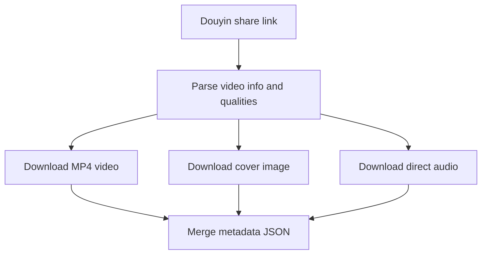
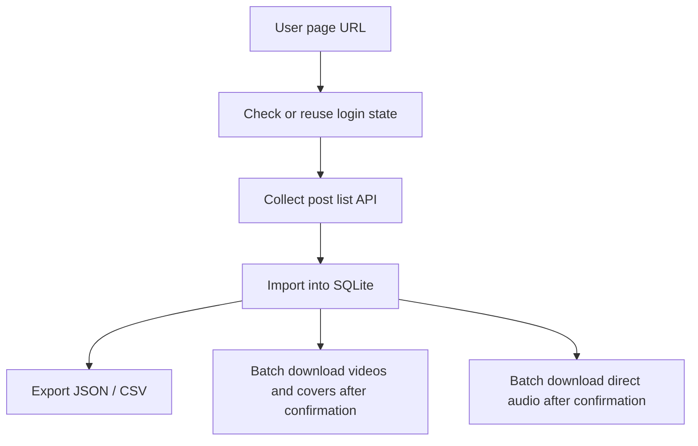

# douyin-video-downloader

[中文](./README.md) | English

A Douyin competitor collection tool for creators, operators, content researchers, and agent users. It turns scattered browser-only videos, covers, audio, post lists, and engagement data into reusable local assets, reducing manual saving, link copying, and file cleanup so later transcription, topic review, account benchmarking, and content analysis can start from complete, traceable data.

It downloads single videos, cover images, and direct music audio, and it can collect public user-page video lists into SQLite for later batch download and export.

## Install

```bash
git clone https://github.com/chemny/douyin-video-downloader.git
```

Place the cloned folder in the skills directory used by your agent, or import it using your agent's own skill installation flow. Keep `SKILL.md` at the root of that skill folder.

After installing, start a fresh agent session so it can rescan skills.

## Quick Start

Ask your agent:

```text
Use douyin-video-downloader to download this Douyin video and save its cover and audio: {Douyin link}
```

Or run the CLI directly:

```bash
node douyin-video.js info "https://v.douyin.com/example/"
```

## Two Core Workflows

### 1. Single Video Download

Use this for one Douyin share link.



Common actions:

- Inspect video metadata and available quality candidates.
- Download video by `best`, `720p`, `1080p`, or candidate index.
- Download the default medium cover, or choose another cover size.
- Download direct audio from Douyin music metadata without extracting audio from video.

### 2. User Page Collection And Batch Download

Use this to collect a creator's video list first, then download selected media after confirmation.



Default rules:

- Collect at most the first 100 works from a user page.
- Collection only imports and exports data; it never starts downloads automatically.
- Batch downloads process items sequentially and wait at least 5 seconds.
- Video batch downloads ask whether to continue after every 10 successful downloads.
- Successful downloads are recorded and skipped on later runs.

## Core Capabilities

- Parse a Douyin share link and list available video quality candidates.
- Download MP4 video files with a selected quality.
- Download cover images separately or together with video files.
- Download direct music audio from Douyin metadata without ffmpeg extraction.
- Collect a Douyin user page into a local SQLite database.
- Store users, crawl pages, videos, stats, music metadata, and download status.
- Export collection data to JSON or CSV.
- Batch download videos, covers, and direct audio from SQLite.

## Requirements

- Node.js 18 or newer.
- System `sqlite3` for collection database operations.
- Network access to Douyin and Douyin CDN endpoints.
- Optional: Playwright CLI wrapper for `collect-user` browser collection.

Set `PWCLI` if the Playwright CLI wrapper is not under a common skill path:

```bash
export PWCLI="$HOME/.agents/skills/playwright/scripts/playwright_cli.sh"
```

Single video, cover, audio, database import/export, and batch downloads from an existing database do not require Playwright.

See [Runtime Requirements](./docs/runtime-requirements.md) for the full runtime checklist.

## Important Rules

- Do not bypass login, risk-control checks, copyright restrictions, or Douyin platform rules.
- Audio uses only direct Douyin music URLs; do not generate audio from video files.
- User-list collection and downloading are separate steps; ask for confirmation before batch downloads.
- Wait at least 5 seconds between batch items.
- Ask whether to continue after every 10 successful video downloads.
- Do not commit browser profiles, cookies, SQLite databases, debug responses, or downloaded media.

## Command Reference

### Inspect A Video

```bash
node douyin-video.js info "https://v.douyin.com/example/" --cover-size medium
```

### Download Video And Cover

```bash
node douyin-video.js download "https://v.douyin.com/example/" \
  -o ./videos \
  --quality best \
  --cover-size medium
```

### Download Only A Cover

```bash
node douyin-video.js cover "https://v.douyin.com/example/" \
  -o ./covers \
  --cover-size origin
```

### Download Direct Audio

```bash
node douyin-video.js audio "https://v.douyin.com/example/" -o ./audios
```

### Check Login State

```bash
node douyin-video.js check-login --account default
```

`check-login` verifies whether the account browser profile has usable Douyin login cookies. If login is missing, it opens the browser and asks the user to scan the QR code.

### Collect A User Page

```bash
node douyin-video.js collect-user "https://www.douyin.com/user/{sec-user-id}" \
  --account default \
  --db ./douyin_collection.sqlite \
  -o ./collection \
  --limit 100
```

Use `--account {name}` to isolate browser profiles. Without an explicit `--profile-dir`, account profiles are stored under `~/.agents/douyin-video-downloader/accounts/{name}/browser-profile`.

### Batch Download From SQLite

```bash
node douyin-video.js db-download-batch \
  --db ./douyin_collection.sqlite \
  -o ./videos \
  --quality best \
  --cover-size medium \
  --delay-seconds 5 \
  --confirm-every 10 \
  --download-limit 100
```

```bash
node douyin-video.js db-download-audio-batch \
  --db ./douyin_collection.sqlite \
  -o ./audios \
  --delay-seconds 5 \
  --download-limit 100
```

## Data And Files

- SQLite stores users, crawl pages, videos, stats, music metadata, and download status.
- Raw API JSON is preserved for future reprocessing.
- Single-item downloads merge into `*_metadata.json`, so video, cover, and audio paths do not overwrite each other.
- See [Database](./docs/database.md) for the database structure.

## Platform Compatibility

Tested with Codex. Claude Code and OpenClaw are not yet tested in this environment, but the skill is designed as a portable single-skill repository with `SKILL.md` at the root.

## Repository Structure

```text
douyin-video-downloader/
├── SKILL.md
├── README.md
├── README.en.md
├── douyin-video.js
├── package.json
├── LICENSE
├── SECURITY.md
├── CHANGELOG.md
├── scripts/
│   ├── publish-check.mjs
│   ├── smoke-test.mjs
│   └── examples/
│       ├── batch_download.sh
│       ├── collect_user.sh
│       └── single_download.sh
└── docs/
    ├── agent-bootstrap.md
    ├── batch-download.md
    ├── browser-login.md
    ├── cli-contract.md
    ├── database.md
    ├── runtime-requirements.md
    └── troubleshooting.md
```

## Safety

Authentication state is local-only. Do not commit browser profiles, cookies, storage-state files, SQLite databases, or downloaded media. Use downloaded content according to Douyin platform rules and applicable copyright laws.

## License

MIT. See [LICENSE](./LICENSE).
