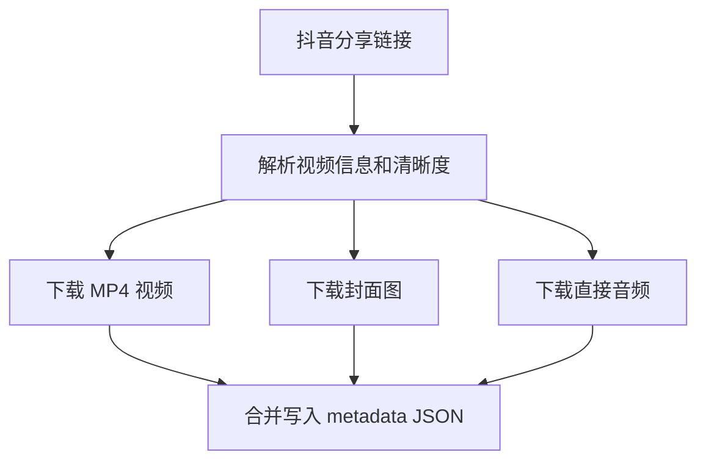
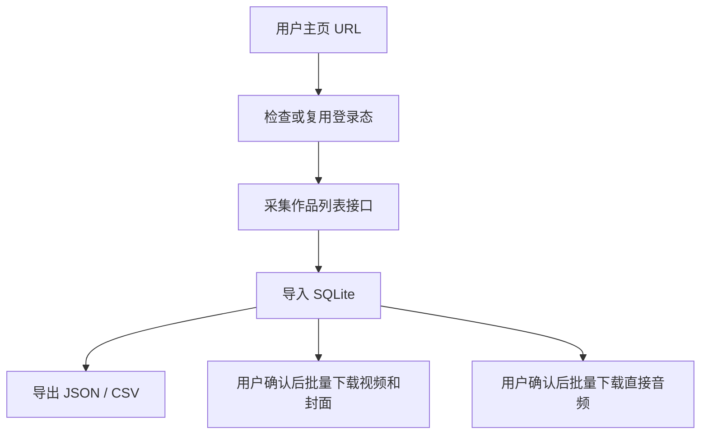

# douyin-video-downloader

中文 | [English](./README.en.md)

面向创作者、运营、内容研究和 Agent 用户的抖音竞品采集工具。它把原本分散在浏览器里的视频、封面、音频、作品列表和互动数据整理成本地可复用的数据资产，减少手动保存、复制链接和反复整理文件的成本，让后续转写、选题复盘、账号对标和内容分析可以从完整、可追溯的数据开始。

它支持下载单条视频、封面图和直接音频，也可以采集用户主页作品列表并保存到 SQLite，方便后续批量下载和导出。

## 怎么安装？

```bash
git clone https://github.com/chemny/douyin-video-downloader.git
```

把克隆后的目录放到你的 Agent 会扫描的 skills 目录里，或按你的 Agent 的安装方式导入。确保 `SKILL.md` 位于该 skill 目录根部。

安装后开一个新的 Agent 会话，让它重新扫描 skills。

## 快速开始

对 Agent 说：

```text
使用 douyin-video-downloader 下载这个抖音视频，并保存封面和音频：{抖音链接}
```

也可以直接运行 CLI：

```bash
node douyin-video.js info "https://v.douyin.com/example/"
```

## 两种核心流程

### 1. 单条视频下载

适合处理一个抖音分享链接。



常用动作：

- 查看视频信息和清晰度候选。
- 按 `best`、`720p`、`1080p` 或候选序号下载视频。
- 下载默认中档封面，也可以选择其他封面尺寸。
- 下载抖音音乐信息里的直接音频，不从视频里抽音频。

### 2. 用户主页采集和批量下载

适合先采集一个账号的视频列表，再按用户确认批量下载。



默认规则：

- 用户主页最多先采集前 100 条作品。
- 采集完成后只入库和导出，不自动下载。
- 批量下载逐条处理，至少间隔 5 秒。
- 批量视频下载每成功 10 个询问是否继续。
- 已成功下载的内容会记录状态，后续重复执行会跳过。

## 核心能力

- 解析抖音分享链接，并列出视频清晰度候选。
- 按指定清晰度下载 MP4 视频。
- 单独下载封面图，或下载视频时同步保存封面。
- 通过抖音音乐信息下载直接音频，不使用 ffmpeg 抽取音频。
- 采集抖音用户主页作品列表到本地 SQLite。
- 保存用户、列表页、视频、互动数据、音乐数据和下载状态。
- 导出 JSON 或 CSV。
- 从 SQLite 批量下载视频、封面和直接音频。

## 运行要求

- Node.js 18 或更高版本。
- 系统 `sqlite3`，用于本地采集库。
- 能访问抖音和抖音 CDN。
- 可选：`collect-user` 浏览器采集需要 Playwright CLI wrapper。

如果 Playwright CLI wrapper 不在常见 skill 路径下，可以设置 `PWCLI`：

```bash
export PWCLI="$HOME/.agents/skills/playwright/scripts/playwright_cli.sh"
```

单条视频、封面、音频、数据库导入、导出，以及基于已有数据库的批量下载，不需要 Playwright。

完整运行要求见 [Runtime Requirements](./docs/runtime-requirements.md)。

## 重要规则

- 不绕过登录、风控、版权限制或抖音平台规则。
- 音频只使用抖音音乐信息里的直接音频地址，不从视频里生成。
- 用户列表采集和下载是两个步骤，采集完成后必须先让用户确认。
- 批量下载至少间隔 5 秒。
- 批量视频下载每 10 个询问是否继续。
- 不要提交浏览器 profile、cookie、SQLite 数据库、debug 响应或下载媒体。

## 命令参考

### 查看视频信息

```bash
node douyin-video.js info "https://v.douyin.com/example/" --cover-size medium
```

### 下载视频和封面

```bash
node douyin-video.js download "https://v.douyin.com/example/" \
  -o ./videos \
  --quality best \
  --cover-size medium
```

### 只下载封面

```bash
node douyin-video.js cover "https://v.douyin.com/example/" \
  -o ./covers \
  --cover-size origin
```

### 下载直接音频

```bash
node douyin-video.js audio "https://v.douyin.com/example/" -o ./audios
```

### 检查登录状态

```bash
node douyin-video.js check-login --account default
```

`check-login` 会检查账号浏览器 profile 里是否有可用的抖音登录 cookie。未登录时会打开浏览器并提示扫码。

### 采集用户主页

```bash
node douyin-video.js collect-user "https://www.douyin.com/user/{sec-user-id}" \
  --account default \
  --db ./douyin_collection.sqlite \
  -o ./collection \
  --limit 100
```

推荐用 `--account {name}` 隔离不同账号。未显式指定 `--profile-dir` 时，账号 profile 会保存在 `~/.agents/douyin-video-downloader/accounts/{name}/browser-profile`。

### 从 SQLite 批量下载

```bash
node douyin-video.js db-download-batch \
  --db ./douyin_collection.sqlite \
  -o ./videos \
  --quality best \
  --cover-size medium \
  --delay-seconds 5 \
  --confirm-every 10 \
  --download-limit 100
```

```bash
node douyin-video.js db-download-audio-batch \
  --db ./douyin_collection.sqlite \
  -o ./audios \
  --delay-seconds 5 \
  --download-limit 100
```

## 数据和文件

- SQLite 保存用户、列表页、视频、互动数据、音乐数据和下载状态。
- 原始接口 JSON 会保留，方便后续重新解析。
- 单条下载会合并写入 `*_metadata.json`，避免视频、封面、音频路径互相覆盖。
- 数据库结构见 [Database](./docs/database.md)。

## 平台兼容性

已在 Codex 中测试。Claude Code 和 OpenClaw 当前环境尚未测试，但本仓库按可移植的单 skill 结构设计，`SKILL.md` 位于仓库根目录。

## 仓库结构

```text
douyin-video-downloader/
├── SKILL.md
├── README.md
├── README.en.md
├── douyin-video.js
├── package.json
├── LICENSE
├── SECURITY.md
├── CHANGELOG.md
├── scripts/
│   ├── publish-check.mjs
│   ├── smoke-test.mjs
│   └── examples/
│       ├── batch_download.sh
│       ├── collect_user.sh
│       └── single_download.sh
└── docs/
    ├── agent-bootstrap.md
    ├── batch-download.md
    ├── browser-login.md
    ├── cli-contract.md
    ├── database.md
    ├── runtime-requirements.md
    └── troubleshooting.md
```

## 安全说明

登录态只保存在本地。不要提交浏览器 profile、cookie、storage-state、SQLite 数据库或下载的媒体文件。下载内容请遵守抖音平台规则和相关版权法律。

## License

MIT。见 [LICENSE](./LICENSE)。
