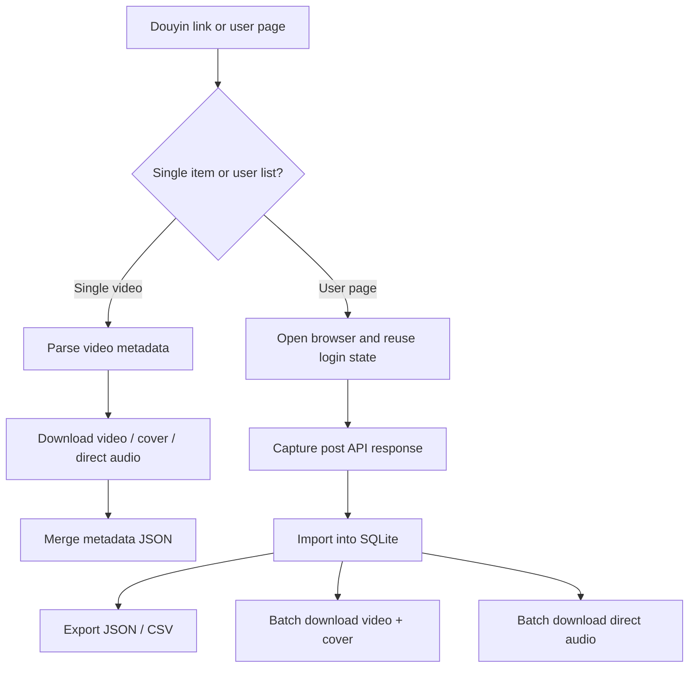

# douyin-video-downloader

[中文](./README.zh.md) | English

Download Douyin videos, covers, direct music audio, and user-list metadata into a local SQLite collection for repeatable content collection workflows.

## Who Is This For?

This skill is for creators, operators, and agent users who need a local-first Douyin collection workflow: saving individual videos, preserving cover images, collecting public user-page video metadata, and downloading direct audio for later transcription or analysis.

It is useful when you need a repeatable collection pipeline instead of one-off browser clicks. It is less useful if you need cloud scheduling, multi-user collaboration, or a platform-policy bypass. This project does not bypass login, anti-bot checks, copyright restrictions, or Douyin platform rules.

## What It Does

- Parse a Douyin share link and list available video quality candidates.
- Download MP4 video files with a selected quality.
- Download cover images separately or together with video files.
- Download direct music audio from Douyin music metadata without extracting audio from video.
- Collect a Douyin user page into a local SQLite database.
- Store users, crawl pages, videos, stats, music metadata, and download status.
- Export collection data to JSON or CSV.
- Batch download videos, covers, and direct audio from the SQLite collection.

## Why Install It?

Manual collection is easy to lose track of: links, covers, audio, interaction counts, and downloaded files quickly drift apart. This skill keeps those pieces tied together through metadata JSON files and a local SQLite database, so later analysis can start from a consistent source of truth.

## Core Workflow



## Quick Start

```bash
node douyin-video.js info "https://v.douyin.com/example/" --cover-size medium
node douyin-video.js download "https://v.douyin.com/example/" -o ./output --quality best
node douyin-video.js audio "https://v.douyin.com/example/" -o ./output
```

Success means the command prints parsed metadata and writes media files plus a `*_metadata.json` file into the output directory.

## Install

`douyin-video-downloader` is published as a single-skill repository. The repository root is the skill root.

Required shape:

```text
douyin-video-downloader/
└── SKILL.md
```

### 1. Clone

```bash
git clone https://github.com/<owner>/douyin-video-downloader.git
```

### 2. Place It In Your Agent's Skills Directory

Copy or symlink the cloned directory into the skills directory used by your agent.

Example:

```bash
ln -s "$PWD/douyin-video-downloader" ~/.agents/skills/douyin-video-downloader
```

### 3. Start A Fresh Agent Session

Many agents scan skill metadata when a new session starts. After installing, open a fresh session so the agent can read `SKILL.md`.

### 4. Verify

Ask your agent:

```text
Use douyin-video-downloader to inspect this Douyin link and list video qualities.
```

### Update

If installed with Git:

```bash
git pull
```

## Requirements

- Node.js 18 or newer.
- System `sqlite3` for collection database operations.
- Network access to Douyin and Douyin CDN endpoints.
- Optional: Playwright CLI wrapper for `collect-user` browser collection.

Set `PWCLI` if the Playwright CLI wrapper is not under a common skill path:

```bash
export PWCLI="$HOME/.agents/skills/playwright/scripts/playwright_cli.sh"
```

Single video, cover, audio, database import, export, and batch downloads from an existing database do not require Playwright.

## Usage Examples

### Inspect A Video

```bash
node douyin-video.js info "https://v.douyin.com/example/" --cover-size medium
```

### Download Video And Cover

```bash
node douyin-video.js download "https://v.douyin.com/example/" \
  -o ./videos \
  --quality best \
  --cover-size medium
```

### Download Only A Cover

```bash
node douyin-video.js cover "https://v.douyin.com/example/" \
  -o ./covers \
  --cover-size origin
```

### Download Direct Audio

```bash
node douyin-video.js audio "https://v.douyin.com/example/" -o ./audios
```

### Collect A User Page

```bash
node douyin-video.js collect-user "https://www.douyin.com/user/<sec-user-id>" \
  --db ./douyin_collection.sqlite \
  -o ./collection \
  --limit 100
```

`collect-user` reuses a local browser profile. If login is unavailable, it opens the browser and asks the user to scan the QR code before continuing.

### Batch Download From SQLite

```bash
node douyin-video.js db-download-batch \
  --db ./douyin_collection.sqlite \
  -o ./videos \
  --quality best \
  --cover-size medium \
  --delay-seconds 5 \
  --confirm-every 10 \
  --download-limit 100
```

```bash
node douyin-video.js db-download-audio-batch \
  --db ./douyin_collection.sqlite \
  -o ./audios \
  --delay-seconds 5 \
  --download-limit 100
```

## Design Principles

- Local-first: data stays in SQLite and media stays on disk.
- Preserve raw responses: original API JSON is stored for future reprocessing.
- Do not extract audio from video: audio uses Douyin music direct URLs only.
- Separate collection and downloading: user-list collection never starts downloads automatically.
- Conservative batch behavior: wait between downloads and record status for skipped/retryable work.

## Platform Compatibility

Tested with Codex. Claude Code and OpenClaw are not yet tested in this environment, but the skill is designed as a portable single-skill repository with `SKILL.md` at the root.

## Repository Structure

```text
douyin-video-downloader/
├── SKILL.md
├── douyin-video.js
├── package.json
├── LICENSE
├── SECURITY.md
├── CHANGELOG.md
└── docs/
    ├── batch-download.md
    ├── browser-login.md
    └── database.md
```

## Safety

Authentication state is local-only. Do not commit browser profiles, cookies, storage-state files, SQLite databases, or downloaded media. Use downloaded content according to Douyin platform rules and applicable copyright laws.

## License

MIT. See [LICENSE](./LICENSE).
