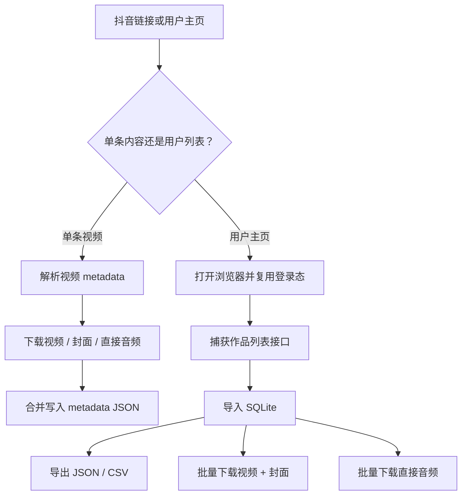

# douyin-video-downloader

中文 | [English](./README.md)

把抖音视频、封面图、直接音频和用户主页视频列表数据采集到本地 SQLite，形成可复用的内容下载与数据采集流程。

## 适合谁？

这个 skill 适合需要做本地化抖音内容采集的创作者、运营人员和 Agent 用户：保存单条视频、保留封面图、采集用户主页公开视频列表、下载直接音频，方便后续转写或分析。

它适合替代反复手动点击、复制链接和整理文件的流程。不适合云端调度、多人协作、绕过平台登录或绕过风控。本项目不会绕过登录、反爬、版权限制或抖音平台规则。

## 它能做什么？

- 解析抖音分享链接，并列出视频清晰度候选。
- 按指定清晰度下载 MP4 视频。
- 单独下载封面图，或下载视频时同步保存封面。
- 通过抖音音乐信息下载直接音频，不从视频里抽取音频。
- 把抖音用户主页作品列表采集到本地 SQLite。
- 保存用户、列表页、视频、互动数据、音乐数据和下载状态。
- 导出 JSON 或 CSV。
- 从 SQLite 批量下载视频、封面和直接音频。

## 为什么值得安装？

手动采集很容易把链接、封面、音频、互动数据和下载文件弄散。这个 skill 用 metadata JSON 和本地 SQLite 把这些信息绑定在一起，后续做转写、复盘或竞品对标时，可以从一个稳定的数据底座开始。

## 核心流程



## 快速开始

```bash
node douyin-video.js info "https://v.douyin.com/example/" --cover-size medium
node douyin-video.js download "https://v.douyin.com/example/" -o ./output --quality best
node douyin-video.js audio "https://v.douyin.com/example/" -o ./output
```

成功时，命令会输出解析到的信息，并在输出目录写入媒体文件和 `*_metadata.json`。

## 怎么安装？

`douyin-video-downloader` 是一个「单 skill 单仓库」。仓库根目录就是 skill 根目录。

必须满足这个结构：

```text
douyin-video-downloader/
└── SKILL.md
```

### 1. 克隆仓库

```bash
git clone https://github.com/<owner>/douyin-video-downloader.git
```

### 2. 放到你的 Agent skills 目录

把克隆下来的目录复制或软链接到你的 Agent skills 目录里。

示例：

```bash
ln -s "$PWD/douyin-video-downloader" ~/.agents/skills/douyin-video-downloader
```

### 3. 开一个新会话

很多 Agent 会在新会话启动时扫描 skill metadata。安装后建议重新开启一个新会话。

### 4. 验证是否生效

可以对 Agent 说：

```text
使用 douyin-video-downloader 检查这个抖音链接，并列出视频清晰度。
```

### 后续更新

如果你是用 Git 安装的：

```bash
git pull
```

## 运行要求

- Node.js 18 或更高版本。
- 系统 `sqlite3`，用于本地采集库。
- 能访问抖音和抖音 CDN。
- 可选：`collect-user` 浏览器采集需要 Playwright CLI wrapper。

如果 Playwright CLI wrapper 不在常见 skill 路径下，可以设置 `PWCLI`：

```bash
export PWCLI="$HOME/.agents/skills/playwright/scripts/playwright_cli.sh"
```

单条视频、封面、音频、数据库导入、导出，以及基于已有数据库的批量下载，不需要 Playwright。

## 使用示例

### 查看视频信息

```bash
node douyin-video.js info "https://v.douyin.com/example/" --cover-size medium
```

### 下载视频和封面

```bash
node douyin-video.js download "https://v.douyin.com/example/" \
  -o ./videos \
  --quality best \
  --cover-size medium
```

### 只下载封面

```bash
node douyin-video.js cover "https://v.douyin.com/example/" \
  -o ./covers \
  --cover-size origin
```

### 下载直接音频

```bash
node douyin-video.js audio "https://v.douyin.com/example/" -o ./audios
```

### 采集用户主页

```bash
node douyin-video.js collect-user "https://www.douyin.com/user/<sec-user-id>" \
  --db ./douyin_collection.sqlite \
  -o ./collection \
  --limit 100
```

`collect-user` 会复用本地浏览器登录态。如果登录态不可用，会打开浏览器并提示用户扫码登录，然后继续采集。

### 从 SQLite 批量下载

```bash
node douyin-video.js db-download-batch \
  --db ./douyin_collection.sqlite \
  -o ./videos \
  --quality best \
  --cover-size medium \
  --delay-seconds 5 \
  --confirm-every 10 \
  --download-limit 100
```

```bash
node douyin-video.js db-download-audio-batch \
  --db ./douyin_collection.sqlite \
  -o ./audios \
  --delay-seconds 5 \
  --download-limit 100
```

## 设计原则

- 本地优先：数据保存在 SQLite，媒体文件保存在本地磁盘。
- 保留原始响应：保存接口原始 JSON，方便后续重新解析。
- 不从视频抽音频：音频只使用抖音音乐直接地址。
- 采集和下载分离：采集用户列表后不会自动开始下载。
- 批量下载保守执行：下载之间有间隔，并记录成功/失败状态。

## 平台兼容性

已在 Codex 中测试。Claude Code 和 OpenClaw 当前环境尚未测试，但本仓库按可移植的单 skill 结构设计，`SKILL.md` 位于仓库根目录。

## 仓库结构

```text
douyin-video-downloader/
├── SKILL.md
├── douyin-video.js
├── package.json
├── LICENSE
├── SECURITY.md
├── CHANGELOG.md
└── docs/
    ├── batch-download.md
    ├── browser-login.md
    └── database.md
```

## 安全说明

登录态只保存在本地。不要提交浏览器 profile、cookie、storage-state、SQLite 数据库或下载的媒体文件。下载内容请遵守抖音平台规则和相关版权法律。

## License

MIT。见 [LICENSE](./LICENSE)。
